# Zero Knowledge Authentication System
## Demo Flow

`Register → Login → JWT Token → Protected Endpoint → Secure Access Granted`


Flask tabanlı, JWT destekli, bcrypt ile güvenli hale getirilmiş, REST API ve Swagger dokümantasyonu içeren modern bir kimlik doğrulama sistemi.

Bu proje, kullanıcıların gizli bilgilerini doğrudan paylaşmadan kimlik doğrulama mantığını öğrenmek ve güvenli backend authentication akışını uygulamak amacıyla geliştirilmiştir.

---

## Özellikler

- JWT tabanlı kimlik doğrulama
- bcrypt + salt ile güvenli hashleme
- SQLite veritabanı entegrasyonu
- REST API mimarisi
- Swagger/OpenAPI dokümantasyonu
- Authorization Header ile korunan endpoint
- Challenge-response doğrulama mantığı
- Modern HTML/CSS arayüz
- Thunder Client ile API testleri

---

## Kullanılan Teknolojiler

- Python
- Flask
- SQLite
- bcrypt
- PyJWT
- Flasgger / Swagger
- HTML5
- CSS3
- Thunder Client

---

## Proje Yapısı

```bash
zero-knowledge-auth-system/
│
├── screenshots/
├── static/
│   └── style.css
├── templates/
│   ├── dashboard.html
│   ├── index.html
│   ├── login.html
│   ├── register.html
│   └── result.html
├── app.py
├── requirements.txt
├── README.md
└── .gitignore
```

---

## Kurulum ve Çalıştırma

```bash
git clone https://github.com/ikrabaser/zero-knowledge-auth-system.git
cd zero-knowledge-auth-system
pip install -r requirements.txt
python app.py
```

Uygulama:

```bash
http://127.0.0.1:5000
```

Swagger dokümantasyonu:

```bash
http://127.0.0.1:5000/apidocs
```

## Bu Projede Kazandıklarım

- REST API mimarisi geliştirme deneyimi
- JWT tabanlı authentication akışını uygulama
- bcrypt ile güvenli parola hashleme mantığını öğrenme
- Swagger ile API dokümantasyonu hazırlama
- Authorization header kullanımı
- Protected endpoint yapısı geliştirme
- API test süreçlerinde Thunder Client kullanımı
- Flask backend proje organizasyonu
- Güvenlik odaklı backend geliştirme yaklaşımı
- ---
## Sistem Mimarisi

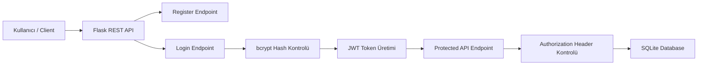

## Authentication Flow

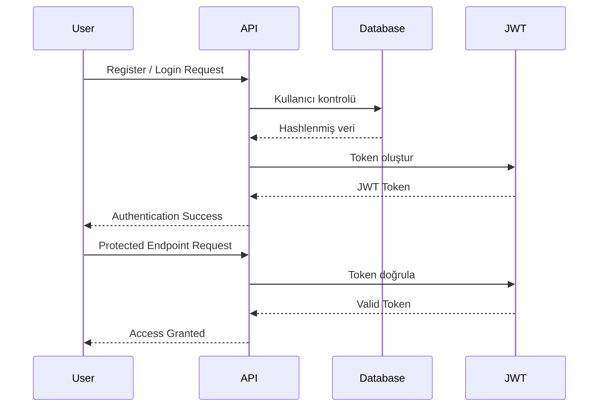
```text
Kullanıcı kayıt olur
        ↓
Gizli bilgi bcrypt + salt ile hashlenir
        ↓
Hash veritabanında saklanır
        ↓
Kullanıcı giriş yapar
        ↓
Challenge-response mantığı çalışır
        ↓
JWT token üretilir
        ↓
Korunan API endpointlerine erişim sağlanır
```
---

## API Endpointleri

| Method | Endpoint | Açıklama |
|---|---|---|
| POST | `/api/register` | API üzerinden kullanıcı kaydı oluşturur |
| POST | `/api/login` | Kullanıcıyı doğrular ve JWT token üretir |
| GET | `/api/profile` | Authorization header ile JWT token doğrular |

---

## Ana Sayfa

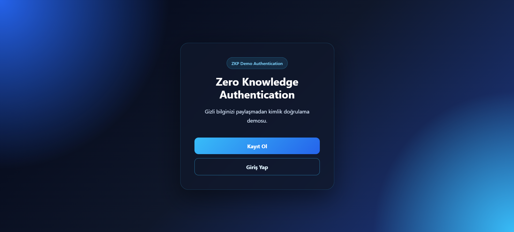

---

## Kayıt Sonucu

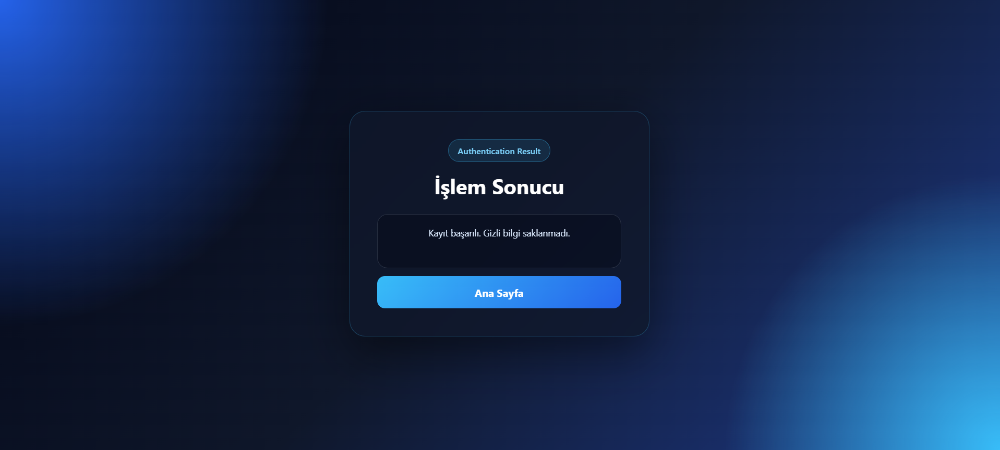

---

## Dashboard ve JWT Token

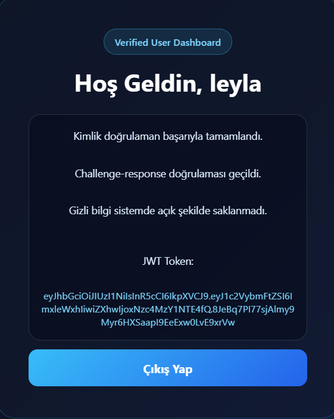

---

## Swagger API Documentation

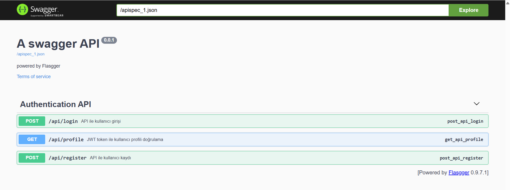

### Swagger Login Endpoint

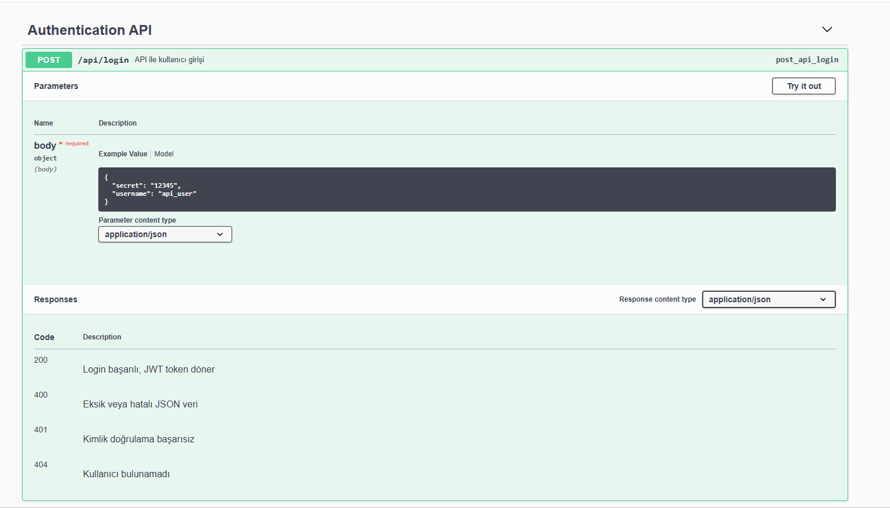

### Swagger Register Endpoint

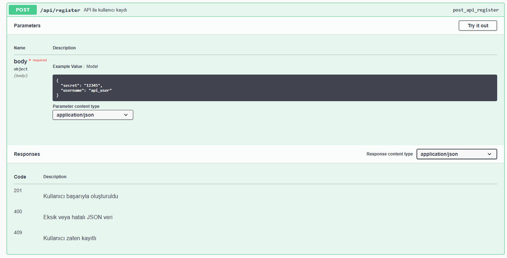

### Swagger Profile Endpoint

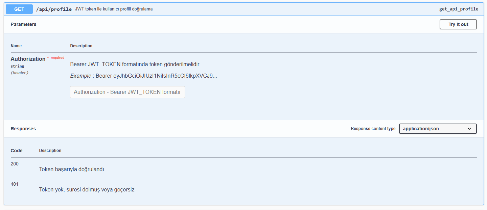

---

## Thunder Client API Testleri

### API Register Testi

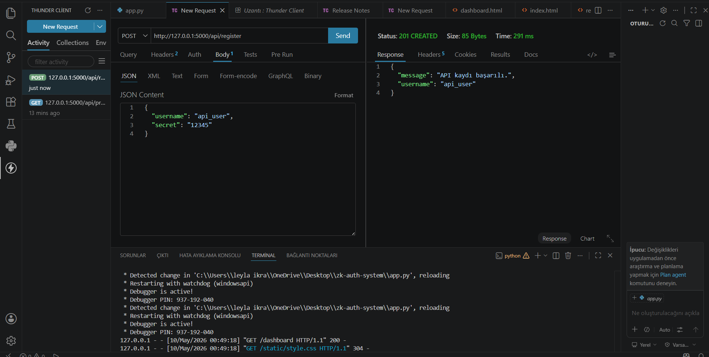

### API Login Testi

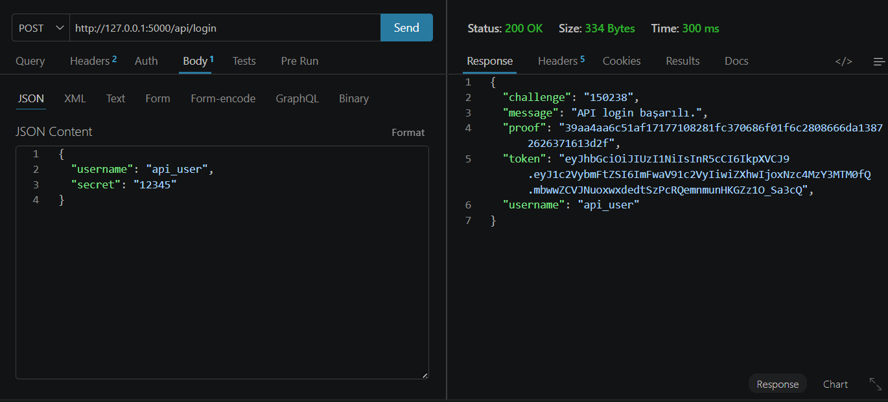

### API Profile Testi

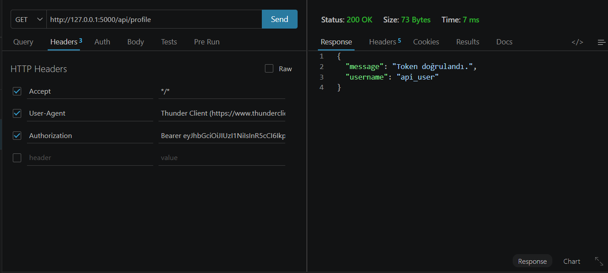

---

## Güvenlik Özellikleri

Bu projede güvenli authentication akışını göstermek için aşağıdaki yapılar kullanılmıştır:

- Kullanıcı gizli bilgisi açık şekilde saklanmaz.
- bcrypt ile otomatik salt üretilir.
- JWT token ile kimlik doğrulama yapılır.
- `/api/profile` endpointi Authorization header olmadan erişime kapalıdır.
- Token süresi 1 saat olarak ayarlanmıştır.
- Challenge-response mantığı ile doğrulama süreci desteklenmiştir.

---

## Not

Bu proje eğitim ve portfolyo amacıyla geliştirilmiş bir demo authentication sistemidir. Production ortamında kullanılmadan önce secret key yönetimi, environment variable kullanımı, rate limiting, refresh token ve gelişmiş hata yönetimi gibi ek güvenlik önlemleri uygulanmalıdır.

---

## Geliştirici

**Leyla İkra Başer**  
Bilgisayar Mühendisliği Öğrencisi

GitHub: [ikrabaser](https://github.com/ikrabaser)
